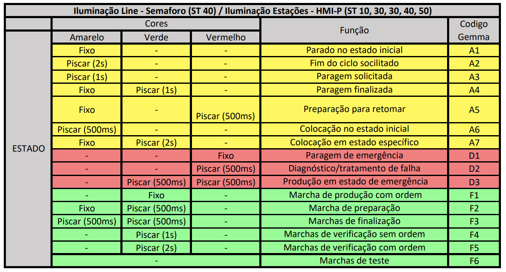

# Projeto 1 - Implementação do Gemma
## Line 32: YL-335B

Considerações:
- Modos de Marcha - Automcatico e Ciclo
- Modos de Paragem - Solicitada e Emergência
- Diagnóstico/tratamento de falha
- Implementação de Sinalização

### Gemma

### Guia de Iluminação 

### Grafcet Geral (Estações)

### Grafcets Iluminação (Etapas, Grafcet Geral)

#### Explicação

- **Etapa A6** - Parado no estado inicial, assim que o PLC entrar em **Modo Run**, a FC **Init** é *corrida* e essa informação é guardada e envidada para a próxima etapa.

- **Etapa A1** - Parado no estado inicial, nesta estapa,confirmamos que o **Init** foi *corrido*. Também é verificado se as **Estações 20 e 40** contém peças para começar o processo. Caso as **duas** estações contenham peças passamos a próxima etapa, caso isso não aconteça ficamos na etapa. 

- **Etapa F2** - Marcha de preparação, nesta estapa, confirmamos **Estações 20 e 40** contém peças para começar o processo. Quando for dado o **Start Inicial (SB1)** passamos a próxima etapa.

      Através do **Seletor (SA)** é possivel escolher o modo de funcionamento de cada estação. 
      (Posição 0 - Modo de Marcha: Automático / Posição 1 - Modo de Marcha: Ciclo).

- **Etapa F1** - Modo de Marcha: Automático (Corre a estação de forma automático, não sendo necessário qualquer ativação).

- **Etapa F5** - Modo de Marcha: Ciclo (Corre a estação de forma ciclica, assim que concluido e necessário fazer o Start (SB1)).

- **Etapa A3** - Paragem solicitado, através do **Switch (SB2)** é possivel proceder a paragem da estação.

- **Etapa A4** - Paragem finalizada, a paragam solicitada é concluida voltado a assim à **Marcha de Produção**, aguardado a ordem de inicialização da produção (Start (SB1)).

- **Etapa D1** - Paragem de emergência, através da **Botoneira (QS)** é possivel proceder a paragem de emergencia da estação.

- **Etapa A5** - Preparação para retomar, a emergência é retirada. Desta forma o processo pode retomar o processo, com a necessidade de fazer a inicilização da estação.

- **Etapa D3** - Produção em estado de emergência, nesta etapa, mesmo a estação estando em emergência, pode continua em funcionamento até concluir o ciclo. 

- **Etapa D2** - Diagnóstico/tratamento de falha, nesta etapa, é diagnósticado/tratado o que originou a falha.
